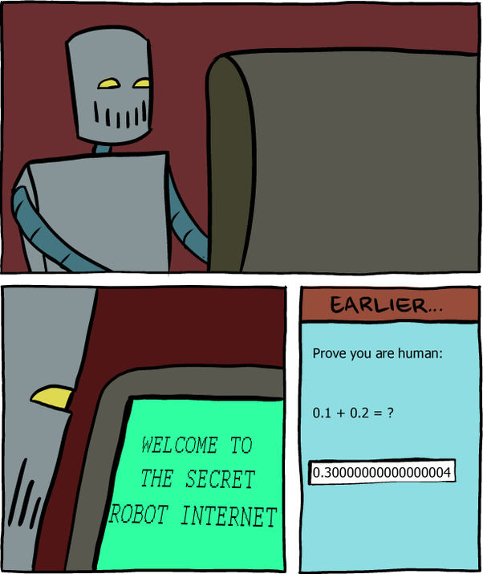

# 𝙃𝙚𝙡𝙡𝙤, 𝙄'𝙢 Keylen                       

#### 💻 𝑨𝒔 𝒂 𝑾𝒆𝒃𝟑 𝒅𝒆𝒗𝒆𝒍𝒐𝒑𝒆𝒓, 𝒇𝒐𝒓 𝒎𝒆, 𝒄𝒐𝒅𝒆 𝒊𝒔 𝒏𝒐𝒕 𝒋𝒖𝒔𝒕 𝒂 𝒑𝒓𝒐𝒅𝒖𝒄𝒕𝒊𝒗𝒊𝒕𝒚 𝒕𝒐𝒐𝒍🛠️, 𝒃𝒖𝒕 𝒂𝒍𝒔𝒐 𝒂𝒏 𝒂𝒓𝒕 𝒕𝒉𝒂𝒕 𝒔𝒂𝒕𝒊𝒔𝒇𝒊𝒆𝒔 𝒎𝒚 𝒄𝒓𝒆𝒂𝒕𝒊𝒗𝒆 𝒅𝒆𝒔𝒊𝒓𝒆𝒔! 🎨

## Social

## Front-end 𝗦𝘁𝗮𝗰𝗸

## Backend 𝗦𝘁𝗮𝗰𝗸

## Design

## Tool

## 𝗦𝘁𝗮𝘁𝘀

